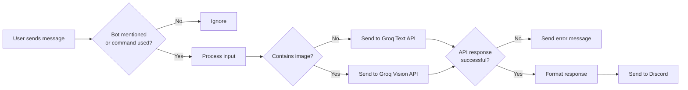

# Groq Discord Bot

A Discord bot that uses Groq's API to access powerful AI language models like LLama 3 and Mixtral directly in your Discord server. Now with vision capabilities to analyze images!

## How It Works



## Features

- Ask AI questions by mentioning the bot
- **NEW**: Analyze images by attaching them to your messages
- Choose from multiple AI models, including vision models
- Simple command interface
- Handles long responses automatically

## Quick Start

### Requirements

- Python 3.8+
- Discord Bot Token
- Groq API Key

### Installation

1. **Clone or download this repository**
2. **Install dependencies**
   ```bash
   pip install -r requirements.txt
   ```
3. **Set up environment variables**
   - Copy `.env.example` to `.env`
   - Add your Discord token and Groq API key
4. **Run the bot**
   ```bash
   python bot.py
   ```

## Usage

### Basic Usage

Just mention the bot with your question:
```
@YourBot What's the capital of France?
```

### NEW: Vision Capabilities

Attach an image and mention the bot with your question about the image:
```
@YourBot [image attached] What's in this image?
```


*Example: A user attaches an image and asks the bot about it*

### Commands

- `!groq <prompt>` - Ask a text question
- `!groq <prompt> model:<model>` - Use a specific text model
- `!vision <prompt>` - Ask about your most recently uploaded image
- `!vision <prompt> model:<model>` - Use a specific vision model
- `!models` - List available models
- `!bothelp` - Show help information

### Available Models

#### Text Models
- `llama3-8b-8192` - Fastest responses
- `llama3-70b-8192` - Most capable (default for text)
- `mixtral-8x7b-32768` - Good for longer contexts
- `gemma-7b-it` - Google's model

#### Vision Models
- `llama-3.2-11b-vision-preview` - Default for images
- `llama-3.2-90b-vision-preview` - More capable vision model

## Vision Examples

### Analyzing Images
The bot can now analyze images and answer questions about them:
- Describe scenes and objects
- Identify text in images
- Answer questions about image content

### Using the Vision Command
If you've already shared an image, you can use the dedicated command:
```
!vision What can you tell me about this image?
```
This will analyze your most recently uploaded image.

## License

MIT License

---

Made with ❤️ using Hikari, Lightbulb, and Groq
