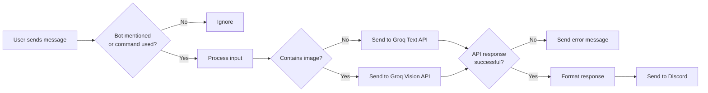

# Groq Discord Bot

[](https://github.com/spped2000/GroqDiscordAssistant/stargazers)
[](https://github.com/spped2000/GroqDiscordAssistant/fork)
[](https://opensource.org/licenses/MIT)

A Discord bot that integrates with Groq's LLM API to provide AI-powered question answering and assistance. Users can interact with different AI models through mentions or commands, maintaining conversation context across interactions. Now with vision capabilities to analyze images!

## 🚀 Quick Links
- [⭐ Star this repo](https://github.com/spped2000/GroqDiscordAssistant/stargazers) เพื่อเป็นกำลังใจให้ผู้พัฒนา!
- [🍴 Fork this repo](https://github.com/spped2000/GroqDiscordAssistant/fork) เพื่อนำไปพัฒนาต่อ!
- [📝 Report issues](https://github.com/spped2000/GroqDiscordAssistant/issues) ถ้าเจอข้อผิดพลาดหรือบัค

## How It Works


## Features
- Ask AI questions by mentioning the bot
- **NEW**: Analyze images by attaching them to your messages (14/3/2025)
- Choose from multiple AI models, including vision models
- Simple command interface
- Handles long responses automatically

## Quick Start
### Requirements
- Python 3.8+
- Discord Bot Token
- Groq API Key

### Installation
1. **Clone or download this repository**
   ```bash
   git clone [https://github.com/spped2000/GroqDiscordAssistant.git]
   cd GroqDiscordAssistant
   ```
2. **Install dependencies**
   ```bash
   pip install -r requirements.txt
   ```
3. **Set up environment variables**
   - Copy `.env.example` to `.env`
   - Add your Discord token and Groq API key
4. **Run the bot**
   ```bash
   python bot.py
   ```

## Usage
### Basic Usage
Just mention the bot with your question:
```
@YourBot What's the capital of France?
```

*Example: @ตื่นมาโค้ดpython แนะนำอาหารไทยเผ็ดๆหน่อย?*

### Text Chat Examples
#### General Knowledge Queries
You can ask the bot general knowledge questions:
```
@YourBot Who wrote the novel "Pride and Prejudice"?
@YourBot What are the main causes of climate change?
```
#### Using Different Models
Specify a model for different types of responses:
```
!groq "Explain quantum computing in simple terms" model:llama3-70b-8192
!groq "Write a short poem about technology" model:mixtral-8x7b-32768
```
#### Complex Tasks
The bot can handle more complex tasks as well:
```
@YourBot Can you summarize the key differences between machine learning and deep learning?
@YourBot How would you explain the concept of blockchain to a 10-year-old?
```

### NEW: Vision Capabilities
Attach an image and mention the bot with your question about the image:
```
@YourBot [image attached] What's in this image?
```

*Example: @ตื่นมาโค้ดpython วัดนี้คือวัดอะไร?*

### Commands
- `!groq <prompt>` - Ask a text question
- `!groq <prompt> model:<model>` - Use a specific text model
- `!vision <prompt>` - Ask about your most recently uploaded image
- `!vision <prompt> model:<model>` - Use a specific vision model
- `!models` - List available models
- `!bothelp` - Show help information

### Available Models
#### Text Models
- `llama3-8b-8192` - Fastest responses
- `llama3-70b-8192` - Most capable (default for text)
- `mixtral-8x7b-32768` - Good for longer contexts
- `gemma-7b-it` - Google's model

#### Vision Models
- `llama-3.2-11b-vision-preview` - Default for images
- `llama-3.2-90b-vision-preview` - More capable vision model

## Vision Examples
### Analyzing Images
The bot can now analyze images and answer questions about them:
- Describe scenes and objects
- Identify text in images
- Answer questions about image content

### Using the Vision Command
If you've already shared an image, you can use the dedicated command:
```
!vision What can you tell me about this image?
```
This will analyze your most recently uploaded image.

## Contributing
Contributions are welcome! Here's how you can contribute:

1. Fork the repository
2. Create a new branch (`git checkout -b feature/amazing-feature`)
3. Make your changes
4. Commit your changes (`git commit -m 'Add some amazing feature'`)
5. Push to the branch (`git push origin feature/amazing-feature`)
6. Open a Pull Request

## License
MIT License

---

Made with ❤️ using Hikari, Lightbulb, and Groq
