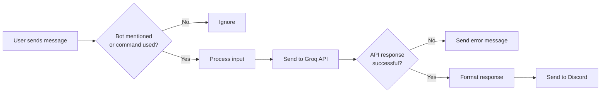
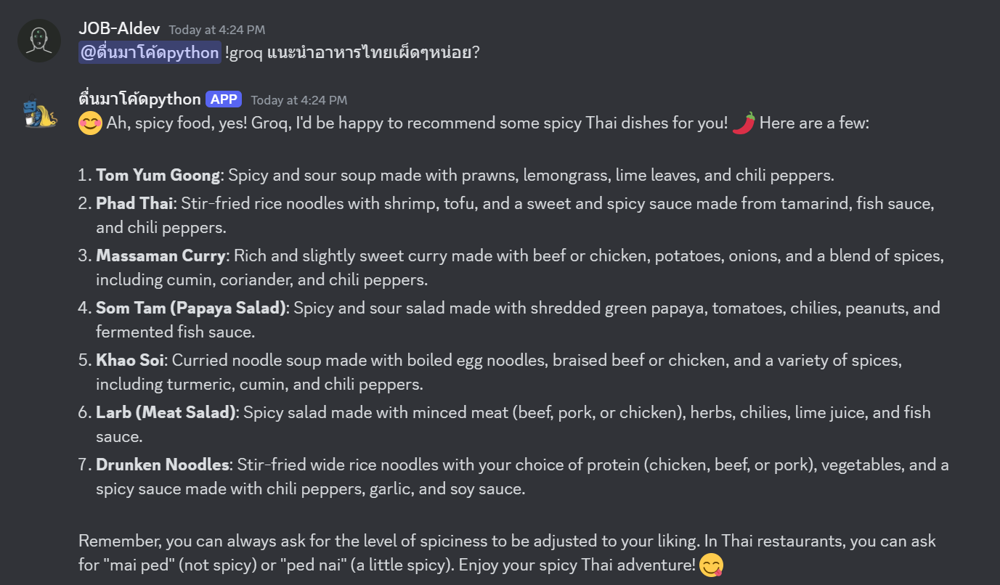

# Groq Discord Bot

A simple Discord bot that uses Groq's API to access powerful AI language models like LLama 3 and Mixtral directly in your Discord server.

## How It Works



## Features

- Ask AI questions by mentioning the bot
- Choose from multiple AI models
- Simple command interface
- Handles long responses automatically

## Quick Start

### Requirements

- Python 3.8+
- Discord Bot Token
- Groq API Key

### Installation

1. **Clone or download this repository**

2. **Install dependencies**
   ```bash
   pip install -r requirements.txt
   ```

3. **Set up environment variables**
   - Copy `.env.example` to `.env`
   - Add your Discord token and Groq API key

4. **Run the bot**
   ```bash
   python bot.py
   ```

## Usage

### Basic Usage

Just mention the bot with your question:
```
@YourBot What's the capital of France?
```



*Example: A user mentions the bot to ask a question, and the bot responds with information from the AI model.*

### Commands

- `!groq <prompt>` - Ask a question
- `!groq <prompt> model:<model>` - Use a specific model
- `!models` - List available models
- `!bothelp` - Show help information

### Available Models

- `llama3-8b-8192` - Fastest responses
- `llama3-70b-8192` - Most capable (default)
- `mixtral-8x7b-32768` - Good for longer contexts
- `gemma-7b-it` - Google's model

## License

MIT License

---

Made with ❤️ using Hikari, Lightbulb, and Groq
